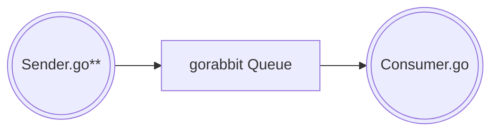

# gorabbit
Go and RabbitMQ

Exploring RabbitMQ with Go

This project consists of a few different RabbitMQ programs to explore the basics ideas
around working with producers, consumers, and queues in RabbitMQ.

#### Producer / Consumer

The `sender.go` program is a simple producer, that sends messages to the queue named "gorabbit". 
The `consumer.go` is a simple consumer that will continually attempt to read any messages waiting in the
queue "gorabbit".