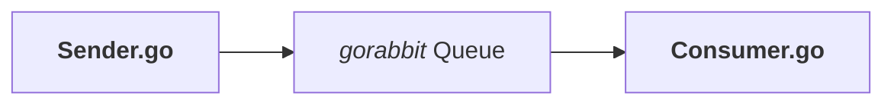

# gorabbit
Go and RabbitMQ

Exploring RabbitMQ with Go

This project consists of a few different RabbitMQ programs to explore the basics ideas
around working with producers, consumers, and queues in RabbitMQ.

#### Producer / Consumer

