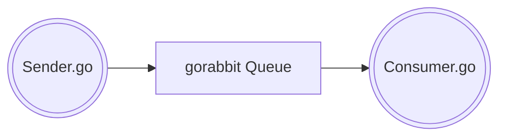
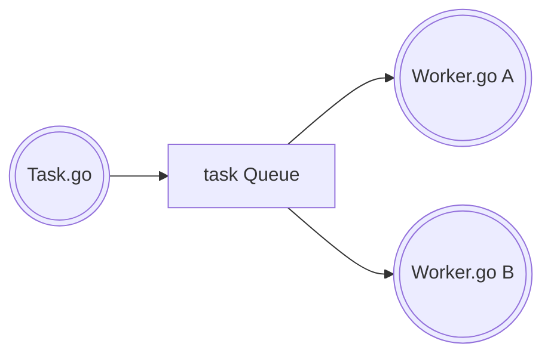

# gorabbit
Go and RabbitMQ

Exploring RabbitMQ with Go

This project consists of a few different RabbitMQ programs to explore the basics ideas
around working with producers, consumers, and queues in RabbitMQ.

#### Producer / Consumer

The `sender.go` program is a simple producer, that sends messages to the queue named "gorabbit". 
The `consumer.go` is a simple consumer that will continually attempt to read any messages waiting in the
queue "gorabbit".

#### Task / Worker

The `task.go` program takes an argument where any `N` number of `.` represents work in terms of seconds
in which the receiving worker node will wait:

`go run cmd/task/task.go work...`

This will result in the consuming worker node to sleep for 3 seconds, upon receiving this message.

Not much has changed from the original consumer in the first examples. The only addition for the
`worker.go` is that we parse the number of '.' within the message to determine how long it should
wait.